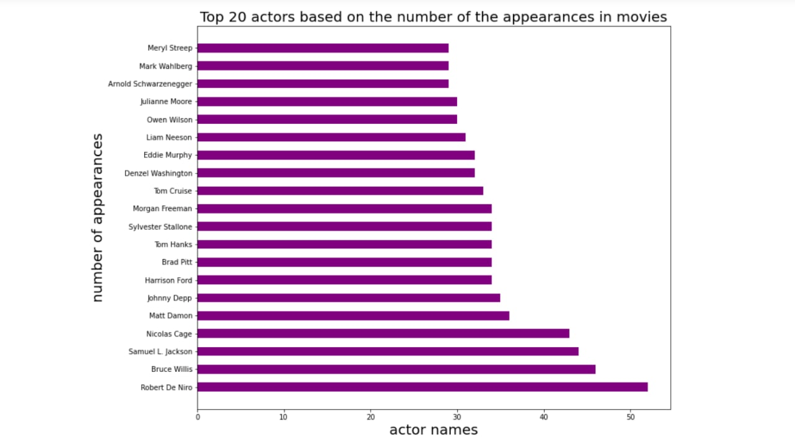
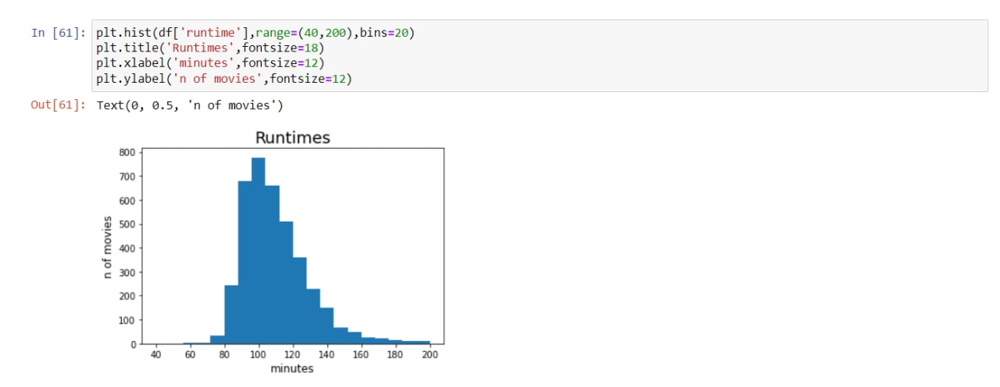
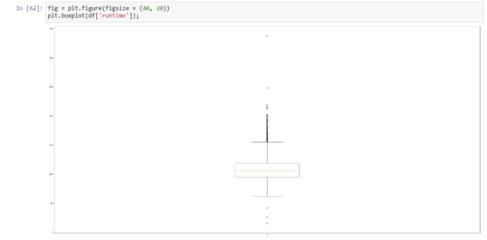
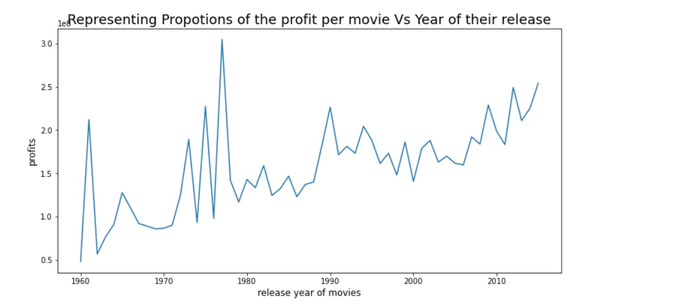
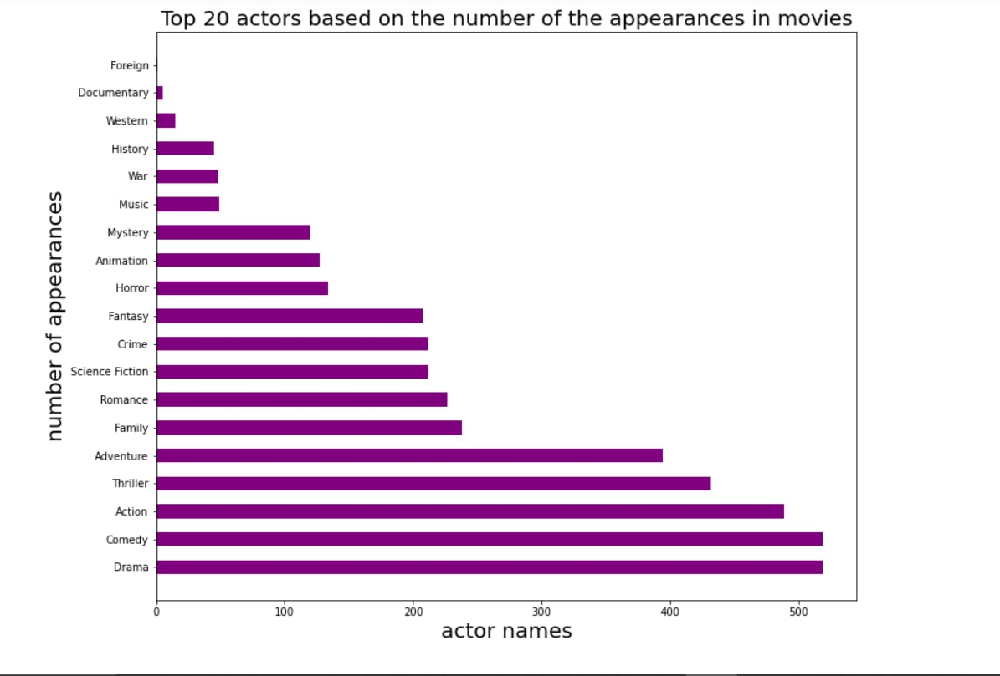

# Data Analysis Project - TMDb - Movies

This data set contains information about 10,000 movies collected from The Movie Database (TMDb)

## Tabel of Contents 
- [Overview](#overview)
    - [ScreenShots](#screenshots)
    - [Conclusion](#conclusion)
    - [Links](#links)
- [Files](#files)  

    - [CSV file](#csv-file)
    - [Analysis file](#pyhon)
- [My-process](#my-process)
    - [Built-with](#built-with)
- [Auther](#Auther)

## Overview

### ScreenShots

### Conclusion
- Robert De Niro is the actor with the most appearance of total 52 time

- The Warrior's Way has lost 5999998 dollar as least profit movie

- Avatar has gained 2544505847 dollar as the most profit movie

- 1977 was the most profitable year

- Action, Comedy and Drama are the most profitable geners

- Movies having profit of 45 million dollar and more have an average budget of 60 million dollar.

- Movies having profit of 45 million dollar and more have an average runtime of 113 minute.

### Links

- For more details: [Analysis file](https://github.com/abduelrahmanemad/TMDP_movies_analysis/blob/main/Data_Analysis_Project.ipynb)

## Files

### CSV file
This is a Comma seperated values - CSV - contains information about 10,000 movies
### Analysis file
Here is where we did all of the analysis and it is coded in python
## My process
### Built with
- Python with Libraries
    - Pandas
    - Numby
    - Matplotlip
- Jupyter notebook

## Auther 
- LinkedIn - [@abdulrahman-masoud](https://www.linkedin.com/in/abdulrahman-masoud-a73504234/)